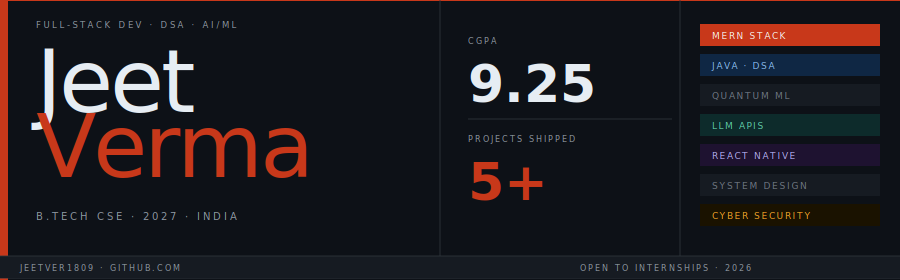

 

> *Building things that work — fast, deployed, and real.*
> CS student who ships instead of just learning.

Currently grinding **Striver's A2Z DSA sheet in Java** while shipping full-stack MERN projects. Explored quantum computing with Qiskit. Integrated LLMs before it was the default thing to do. Targeting competitive internships in **2026**.

 

---

### `02 /` Stack

**Languages** &nbsp;→&nbsp; `Java` `JavaScript` `Python` `C` `HTML/CSS`

**Frameworks** &nbsp;→&nbsp; `React` `Node.js` `Express` `React Native` `FastAPI` `Vite`

**Databases & Cloud** &nbsp;→&nbsp; `MongoDB` `Firebase` `SQL` `Supabase` `Vercel` `Render` `GCP`

**AI / ML** &nbsp;→&nbsp; `Qiskit` `OpenAI` `Gemini` `Groq`

---

### `03 /` Projects

**[P·01] &nbsp; RenQ — Quantum Drug Discovery** &nbsp;·&nbsp; 

> Hybrid quantum-classical ML platform for Alzheimer's BACE-1 inhibition. 9,000+ molecules via RDKit. 40% throughput boost via multithreading.

 &nbsp; `Python` `Qiskit` `FastAPI` `RDKit`

---

**[P·02] &nbsp; Finlogy — Finance Tracker** &nbsp;·&nbsp; 

> Full-stack finance app. 1,000+ monthly transactions. Gemini AI summaries. 30% faster APIs via MongoDB indexing. 150+ peak users.

 &nbsp; `MERN` `OAuth` `MongoDB Atlas` `Gemini AI`

---

**[P·03] &nbsp; StudyStreak — Mobile App** &nbsp;·&nbsp; 

> Cross-platform streak-based productivity app. Firebase real-time sync, push notifications, dual auth. 150+ users.

 &nbsp; `React Native` `Expo` `Firebase`

---

**[P·04] &nbsp; AutoTimeTable — Timetable Builder** &nbsp;·&nbsp; 

> Conflict-free college timetable generator. Smart scheduling logic. Designed for students, built by one.

 &nbsp; `React` `Vite` `JavaScript`

---

### `04 /` Stats

---

### `05 /` Currently building

- ◉ &nbsp;**Striver A2Z DSA** — Arrays, Sliding Window, Kadane's
- ◉ &nbsp;**Sync music player** — real-time listening with friends
- ◉ &nbsp;**System Design** — depth before internship season
- ◉ &nbsp;**2026 internships** — full-stack / backend roles

---

<h1 align="center">Hi 👋, I'm Jeet Verma</h1>

  

  
  

---

### 🌟 About Me

<table align="center" border="0" cellpadding="10" cellspacing="0" width="100%">
  <tr>
    <td width="55%" valign="top">
       
      
🎓 <b>4th-Year Computer Science Student</b> passionate about engineering premium web applications and solving complex algorithmic challenges.

      
💻 Currently crafting full-stack applications with the <b>MERN Stack</b> and sharpening my core programming skills in <b>Java</b>.

      
📈 Goal-driven developer working hard toward cracking elite <b>software engineering internships by 2026</b>.

    </td>
    <td width="45%" align="center">
      
    </td>
  </tr>
</table>

---

### 🔧 Tech Stack

  
  #### 💻 Languages & Frontend
  

   

  #### ⚙️ Backend & Database
  

   

  #### 🛠️ Dev Tools & Version Control
  

---

### 🚀 Highlighted Projects

<table align="center" width="100%">
  <tr>
    <td width="50%" valign="top">
      <h4>🏦 Finance Tracker App</h4>
      
<i>A premium full-stack personal finance tracker designed with responsive dashboards and visual cash-flow analysis.</i>

      

        
        
        
      

    </td>
    <td width="50%" valign="top">
      <h4>📅 AutoTimeTable Generator</h4>
      
<i>An optimized automated scheduling algorithm ensuring clash-free timetable matrix generation for institutions.</i>

      

        
        
        
      

    </td>
  </tr>
  <tr>
    <td width="50%" valign="top">
      <h4>🎲 JS Interactive Arcade</h4>
      
<i>Fun, dynamically interactive browser games and utilities including a custom Drum Kit and a visual Dice Game.</i>

      

        
        
        
      

    </td>
    <td width="50%" valign="top">
      <!-- Add your next major project card here! -->
      <h4>🔮 Up Next</h4>
      
<i>Building advanced distributed backend architectures and scaling dynamic microservices. Stay tuned!</i>

    </td>
  </tr>
</table>

---

### 📊 GitHub Metrics

  
  

---

### 🌐 Let's Connect!

  
  

---

### 🐍 Contribution Activity

  

